# Monobiome
`monobiome` is a minimal, balanced color palette for use in terminals and text
editors. It was designed in OKLCH space to achieve perceptual uniformity across
all hues at various levels of luminance, and does so for eight monotone bases
and eight accent colors (plus one zero chroma default base). Each of the
monotone base colors (named according to a natural biome whose colors they
loosely resemble) are designed to achieve identical contrast with the accents,
and thus any one of the options can be selected to change the feeling of
downstream themes without sacrificing readability.

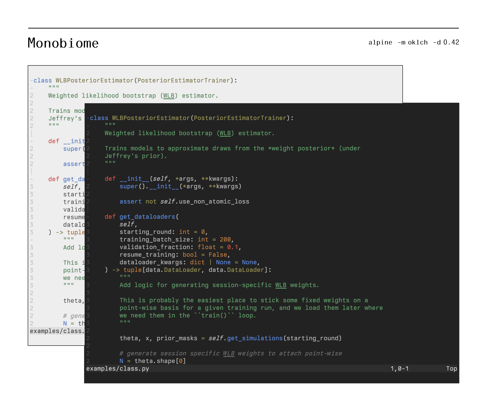
_(Preview of light and dark alpine theme variants)_

The name "monobiome" connects the palette to its two key sources of
inspiration:

- `mono-`: `monobiome` is inspired by the [`monoindustrial` theme][1], and
  attempts to extend and balance its accents while retaining similar color
  identities.
- `-biome`: the desire for several distinct monotone options entailed finding a
  way to ground the subtle color variations that were needed, and I liked the
  idea of tying the choices to naturally occurring environmental variation like
  Earth's biomes (even if it is a very loose affiliation, e.g., green-ish =
  grass, basically).

## Palette
The `monobiome` palette is fundamentally a set of parameterized curves in OKLCH
color space. Each color identity has one monotone curve and one accent curve,
both of which have fixed hue values and vary from 10% to 98% lightness.
Monotone curves have fixed chroma, whereas the accent curves' chroma varies
smoothly as a function of lightness within sRGB gamut bounds.

| Chroma curves | Color trajectories |
|---|---|
| 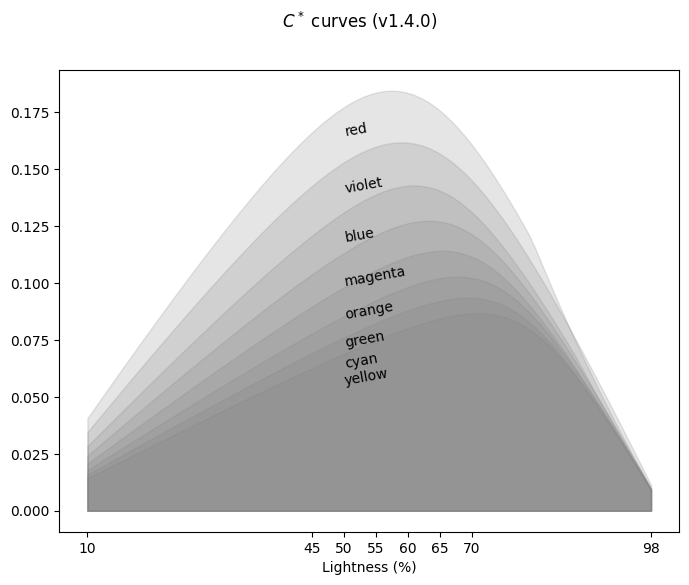 | 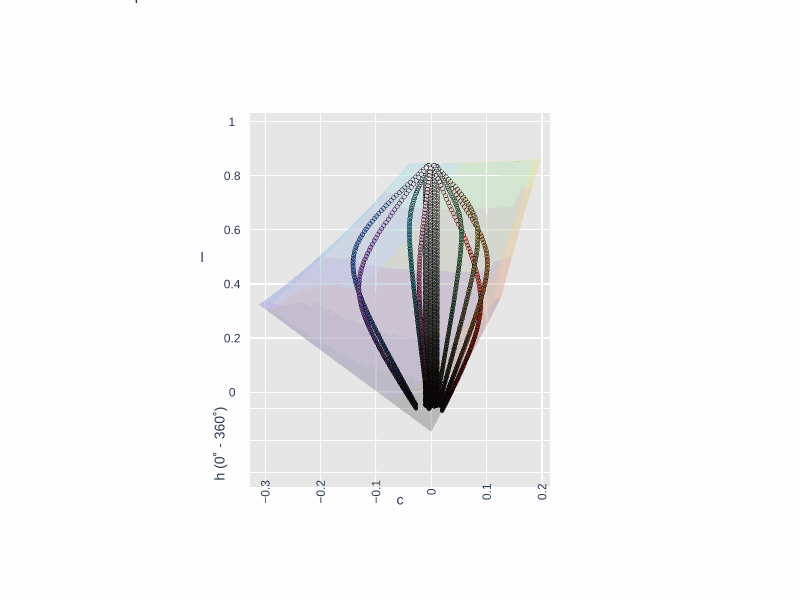 |

| Palette |
|---|
| 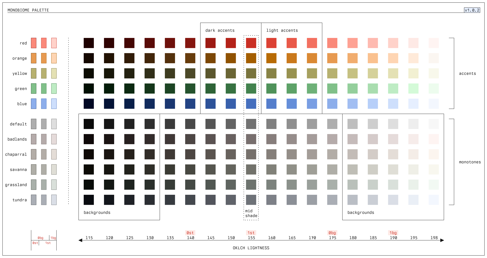 |

Chroma curves are designed specifically to establish a distinct role for each
accent and are non-intersecting over the lightness domain (hence the distinct
"bands" in the above chroma curve figure). There are eight monotone-accent
pairs, plus a single grey trajectory:

| Monotone / biome | Accent color | Hue  |
| ---              | ---          | ---  |
| alpine           | grey         | n/a  |
| badlands         | red          | 29   |
| chaparral        | orange       | 62.5 |
| savanna          | yellow       | 104  |
| grassland        | green        | 148  |
| reef             | cyan         | 205  |
| tundra           | blue         | 262  |
| heathland        | violet       | 306  |
| moorland         | magenta      | 350  |

The `alpine`/`grey` curve has zero chroma (and is thus invariant to hue),
varying only in lightness from dark to light grey.

## Themes

| Dark themes | Light themes |
|---|---|
|  |  |

Themes are derived from the `monobiome` palette by selecting a monotone base
(the "biome"), a base lightness, and a contrast level. Although one can use
arbitrary contrast metrics, OKLCH distance (Euclidean distance in OKLab)
is designed to capture perceptual distinction. As such, perceptually uniform
themes under arbitrary monotones can be generated by calculating the accent
colors equidistant from that base. This is equivalent to determining the points
at which a sphere centered at the monotone base intersects with the accent
curves; the radius of such a sphere effectively determines the theme contrast,
and the colors on the sphere surface are equally perceptually distinct relative
to the background. 

The following plots show the intersection of the sphere centered at a fixed
background color (`alpine` biome with a lightness of 20) under variable radii:

| | `-l 20 -d 0.3` | `-l 20 -d 0.4` | `-l 20 -d 0.5` |
|---|---|---|---|
| Color visualization | 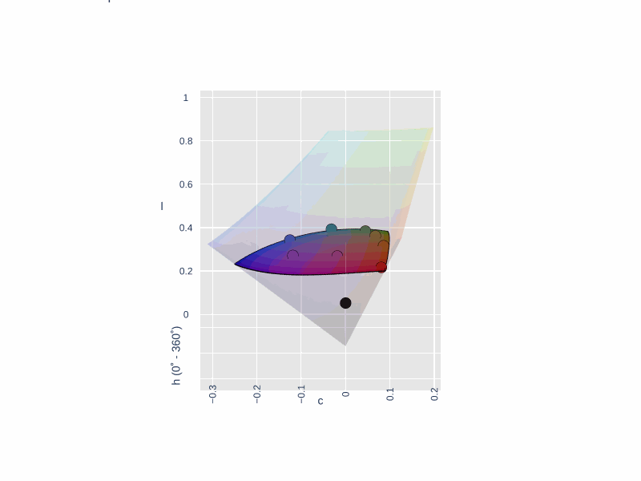 |  | 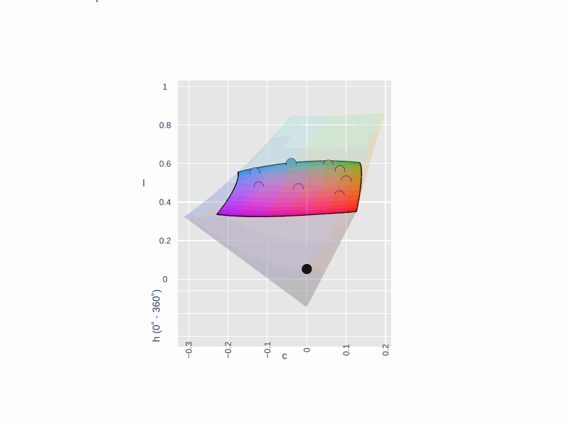 |
| Editor preview | 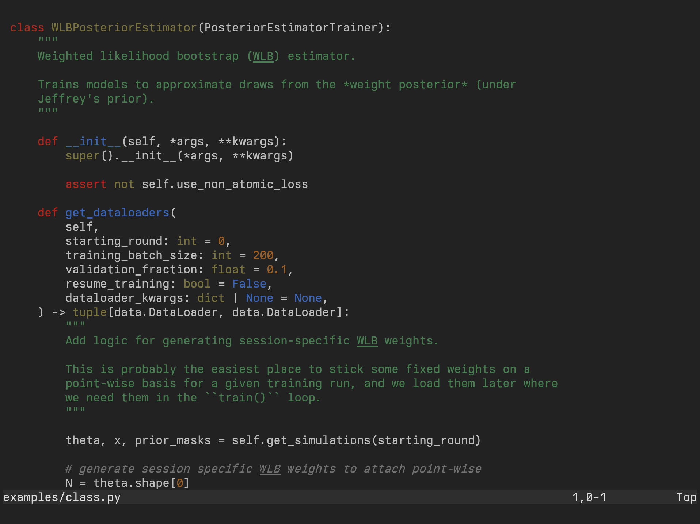 | 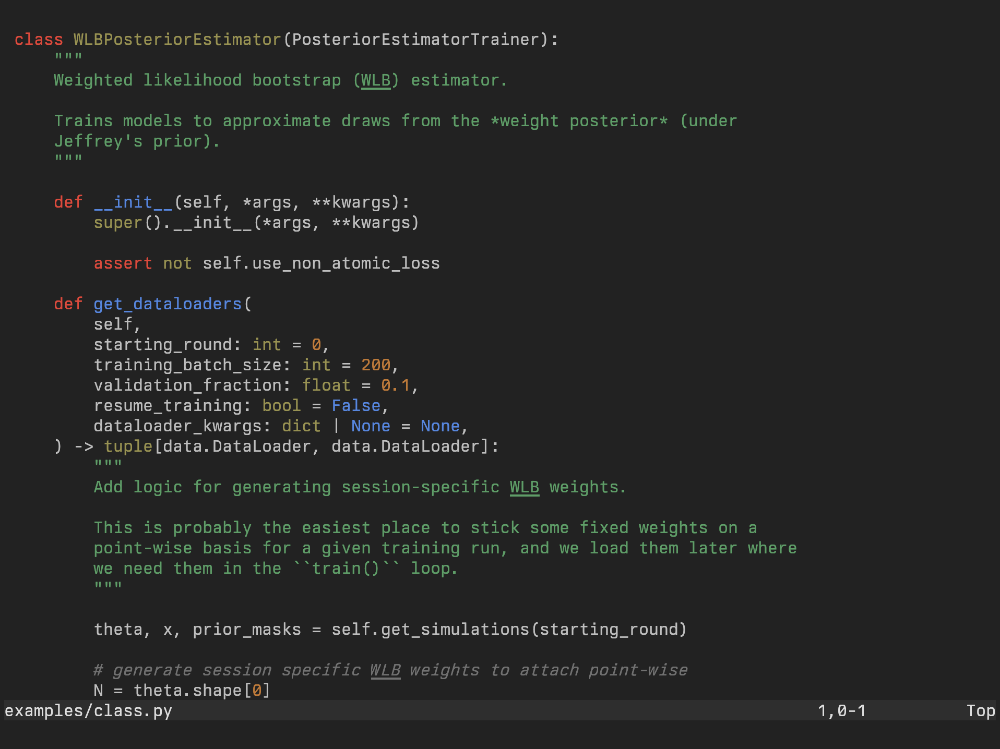 | 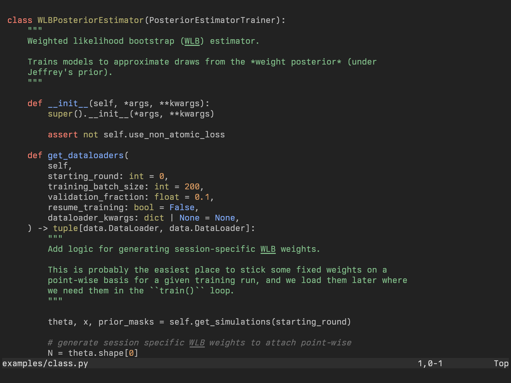 |

In short, the base lightness (`-l`) dictates the brightness of the background,
and the contrast (`-d`) controls how perceptually distinct the accent colors
appear with respect to that background. These are free parameters of the
`monobiome` model: themes can be generated under arbitrary settings that meet
user preferences.

## Generation
When generating full application themes, fixed lightness steps are used in the
chosen monotone trajectory to establish consistent levels of distinction
between background layers. For example, the following demonstrates how
background and foreground elements are chosen for the `monobiome` vim/neovim
themes:


Note how theme elements are mapped onto the general identifiers `bg0-bg3` for
backgrounds, `fg0-fg3` for foregrounds, and `gray` for a central gray tone. The
relative properties (lightness differences, contrast ratios) between colors
assigned to these identifiers are preserved regardless of biome or harshness
(e.g., `bg3` and `gray` are _always_ separated by 20 lightness points in any
theme). As a result, applying `monobiome` themes to specific applications can
effectively boil down to defining a single "relative template" that uses these
identifiers, after which any user-provided parameters can be applied
automatically. 

The full palette $\rightarrow$ scheme $\rightarrow$ template $\rightarrow$
theme pipeline can be seen in detail below: 

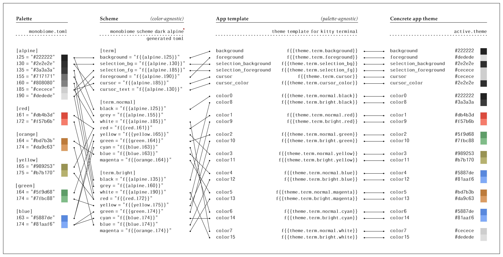

This figure demonstrates how `kitty` themes are generated, but the process is
generic to any palette, scheme, and app. This implemented in two stages using
the `monobiome` CLI:

- First generate the scheme file, the definitions that respect perceptual
  uniformity of accents with respect to the base monotone:

  ```sh
  monobiome scheme dark grassland -d 0.42 -l 20 -o scheme.toml
  ```

  This calculates the accents a distance of `0.42` units in Oklab space from the
  `grassland` monotone base at a lightness of `20`, and writes the output to
  `scheme.toml`.
- Then populate the scheme file with concrete palette colors and push it
  through an app config template:

  ```sh
  monobiome fill scheme.toml templates/kitty/active.theme -o kitty.theme
  ```

  This writes a concrete theme to `kitty.theme` that matches the user
  preferences, i.e., the contrast (`-d`), background lightness (`-l`), mode
  (`dark`), and biome (`grassland`). Every part of this process can be
  customized: the scheme parameters, the scheme definitions/file, the app
  template.

Running these commands in sequence from the repo root should work
out-of-the-box, after having installed the CLI tool.

The `monobiome` CLI
produces the scheme file for requested parameters, and the [`symconf`][3] CLI
pushes palette colors through the scheme and into the app templates to yield a
concrete theme.

## Applications
This repo provides palette-agnostic theme templates for `kitty`,
`vim`/`neovim`, and `fzf` in the `templates/` directory. Pre-generated
*concrete* themes can be found in `app-config/`, if you'd like to try an
example out-of-the-box without using the `monobiome` CLI. Raw
palette colors can be found in `colors/` if you want to use them to define
static themes for other applications.

Themes files in the `app-config/` directory are generated for light and dark
modes of each biome, and named according to the following pattern:

```sh
<biome>-monobiome-<mode>.<filename>
```

One can set these themes for the provided applications as follows:

- `kitty`

  Find `kitty` themes in `app-config/kitty`. Themes can be activated in your
  `kitty.conf` with
  
  ```sh
  include <theme-file>
  ```

  Themes are generated using the [`kitty` theme
  template](templates/apps/kitty/templates/active.theme).

- `vim`/`neovim`

  Find `vim`/`neovim` themes in `app-config/nvim`. Themes can be activated by placing a
  theme file on Vim's runtime path and setting it in your
  `.vimrc`/`init.vim`/`init.lua`

  with
  
  ```sh
  colorscheme <theme-name>
  ```

  Themes are generated using the [`vim` theme
  template](templates/apps/nvim/templates/theme.vim).

- `fzf`

  In `app-config/fzf`, you can find scripts that can be ran to export FZF theme
  variables. In your shell config (e.g., `.bashrc` or `.zshrc`), you can source
  these files to apply them in your terminal:
  
  ```sh
  source <theme-file>
  ```

  Themes are generated using the [`fzf` theme
  template](templates/apps/fzf/templates/active.theme).

- Firefox

  Firefox themes for all monotone backgrounds are publicly listed as [Mozilla
  add-ons][2], and switch between light/dark schemes based on system settings.
  You can also download raw XPI files for each theme in `app-config/firefox/`,
  each of which is generated using the [Firefox `manifest.json`
  template](templates/apps/firefox/templates/none-dark.manifest.json).

  Static [light][4] and [dark][5] themes are additionally available (i.e., that
  don't change with system settings).

  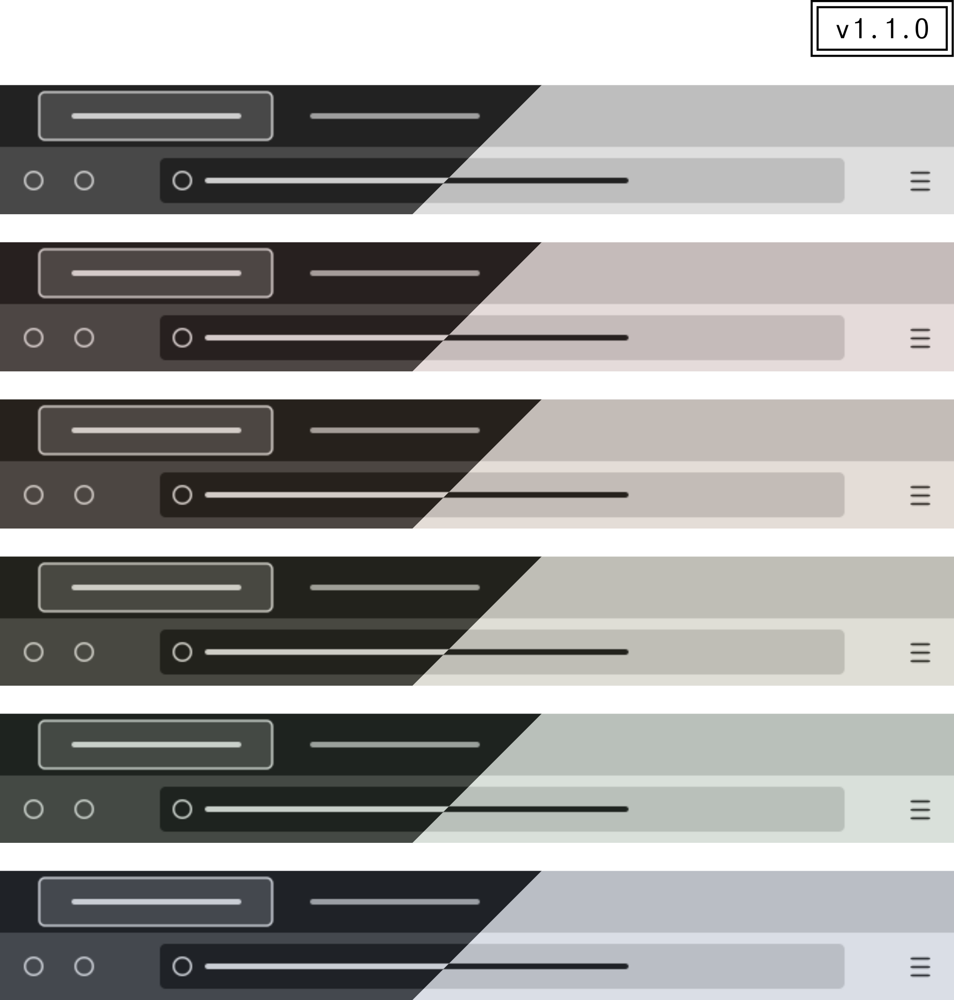

## CLI installation
A brief theme generation guide was provided in the [Generation
section](#generation), making use of the `monobiome` CLI. This tool can be
installed from PyPI, using `uv`/`pipx`/similar:

```sh
uv tool install monobiome
# or
pipx install monobiome
```

The `monobiome` has provides three subcommands:

- `monobiome palette`: generate palette files from raw parameterized curves

  ```
  usage: monobiome palette [-h] [-n {hex,oklch}] [-f {json,toml}] [-o OUTPUT]

  options:
    -n {hex,oklch}, --notation {hex,oklch}
                          color notation to export (either hex or oklch)
    -f {json,toml}, --format {json,toml}
                          format of palette file (either JSON or TOML)
    -o OUTPUT, --output OUTPUT
                          output file to write palette content
  ```

- `monobiome scheme`: generate scheme files that match perceptual parameters

  ```
  usage: monobiome scheme [-h] [-m {wcag,oklch,lightness}] [-d DISTANCE] [-o OUTPUT] [-l L_BASE]
                          [--l-step L_STEP] [--fg-gap FG_GAP] [--grey-gap GREY_GAP]
                          [--term-fg-gap TERM_FG_GAP]
                          {dark,light}
                          {alpine,badlands,chaparral,savanna,grassland,reef,tundra,heathland,moorland}
  
  positional arguments:
    {dark,light}          scheme mode (light or dark)
    {alpine,badlands,chaparral,savanna,grassland,reef,tundra,heathland,moorland}
                          biome setting for scheme.
  
  options:
    -m {wcag,oklch,lightness}, --metric {wcag,oklch,lightness}
                          metric to use for measuring swatch distances.
    -d DISTANCE, --distance DISTANCE
                          distance threshold for specified metric
    -o OUTPUT, --output OUTPUT
                          output file to write scheme content
    -l L_BASE, --l-base L_BASE
                          minimum lightness level (default: 20)
    --l-step L_STEP       lightness step size (default: 5)
    --fg-gap FG_GAP       foreground lightness gap (default: 50)
    --grey-gap GREY_GAP   grey lightness gap (default: 30)
    --term-fg-gap TERM_FG_GAP
                          terminal foreground lightness gap (default: 60)
  ```

- `monobiome fill`: produce concrete application themes from a given scheme and
  app template

  ```
  usage: monobiome fill [-h] [-p PALETTE] [-o OUTPUT] scheme [template]

  positional arguments:
    scheme                scheme file path
    template              template file path (defaults to stdin)
  
  options:
    -p PALETTE, --palette PALETTE
                          palette file to use for color definitions
    -o OUTPUT, --output OUTPUT
                          output file to write filled template
  ```


[1]: https://github.com/isa/TextMate-Themes/blob/master/monoindustrial.tmTheme
[2]: https://addons.mozilla.org/en-US/firefox/collections/18495484/monobiome/
[3]: https://github.com/ologio/symconf
[4]: https://addons.mozilla.org/en-US/firefox/collections/18495484/monobiome-light/
[5]: https://addons.mozilla.org/en-US/firefox/collections/18495484/monobiome-dark/
