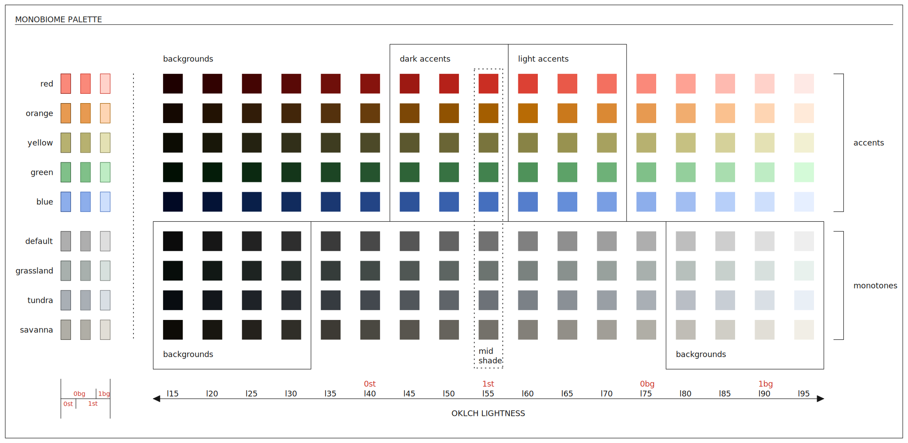
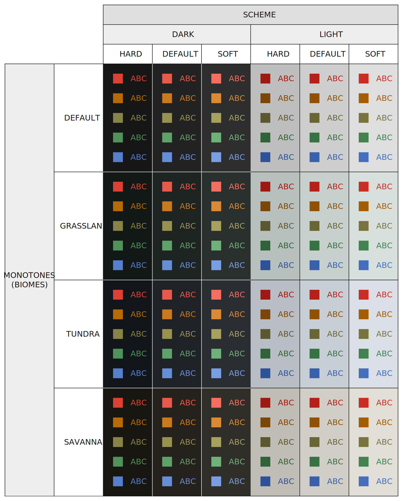

# Monobiome
`monobiome` is a minimal, balanced color palette for use in terminals and text editors. It
was designed in OKLCH space to achieve perceptual uniformity across all hues at various
levels of luminance, and does so for _four_ monotone bases and _five_ accent colors. Each
of the monotone base colors (named according to a natural biome whose colors they loosely
resemble) are designed to achieve identical contrast with the accents, and thus any one of
the four can be selected to change the feeling of the palette without sacrificing
readability.



The name "monobiome" connects the palette to its two key sources of inspiration:

- `mono-`: `monobiome` is inspired by the `monoindustrial` theme, and attempts to extend
  and balance its accents while retaining similar color identities.
- `-biome`: the desire for several distinct monotone options entailed finding a way to ground the
  subtle color variations that were needed, and I liked the idea of tying the choices to
  naturally occurring environmental variation like Earth's biomes (even if it is a very
  loose affiliation, e.g., green-ish = grass, basically).

# Concrete themes
Each biome ("flavor") has 3 levels of "harshness": soft, regular (default), hard. The
harshness level determines the extent of the bg/fg extremes. 



The following general
constraints are followed as palette options are mapping onto concrete themes:

+ Harshness levels have monotone differences of a single shade. 
+ "Hard" themes anchor their background to the most extreme shade appropriate for the
  scheme (i.e., lightest shade for "light," darkest shade for "dark"), ensuring the
  palette's "monotone width" is fully spanned by the theme options.
+ App-specific monotone settings have differences of a single shade compared to the
  system monotone settings.
+ Shade differences between corresponding background/foreground settings should be
  constant (e.g., between `bg0` and `fg3`, `bg1` and `fg2`, etc)

The primary goal of these constraints is to ensure each theme in a collection defined
around a single palette is sufficiently _distinct_ and attains sufficient _breadth_
under the palette.

## Example
The following is a natural solution to these constraints, demonstrated on a general
example setting: A possible useful analogy is a sliding window that, on its own spans a
given theme's bg0 - fg0 settings, while globally sliding across all available values in
the palette. If associating integers 0-10 to indices in a list of monotone shades, and
`bg-fg` is the syntax used to indicate that theme's shade range, we might have the
following for dark mode themes across harshness levels:

```
Dark (system) 0-7 ; 1-8 ; 2-9
Dark (app)    1-8 ; 2-9 ; 3-10
```

There are sliding windows at both the system-app level *and* the harshness-level, in a
sense. Constraints are followed:

+ Harshness levels, separated by semicolon, differ by a single shade from hard to soft.
+ The hard theme anchors its background to the darkest available shade.
+ Monotones between system and app differ by a single shade.
+ Differences between bg/fg (value of 7) remains constant across all themes.

Mapping this onto the common values used in my theme definition files: 

```
System, dark
| Hard       | Regular    | Soft
| bg0 <- l15 | bg0 <- l20 | bg0 <- l25
| fg0 <- l80 | fg0 <- l85 | fg0 <- l90

App, dark
| Hard       | Regular    | Soft
| bg0 <- l20 | bg0 <- l25 | bg0 <- l30
| fg0 <- l85 | fg0 <- l90 | fg0 <- l95

System, light
| Hard       | Regular    | Soft
| bg0 <- l95 | bg0 <- l90 | bg0 <- l85
| fg0 <- l25 | fg0 <- l20 | fg0 <- l15
```

# MONOBIOME SPECIFIC

## Accent contrast
Each group of biome monotones have nearly identical (WCAG 2) contrast ratios against
white/black for all lightness levels (ratios identical between biomes). These are
selected in a heavily constrained OKLCH context, and given the perceptual uniformity
attached to lightness, we can expect very similar contrast ratios for each accent under
a given biome lightness (e.g., the `l65` red tone will have the same ratio under the
grassland, tundra, and savanna monotones).

In terms of selecting accents for themes (by harshness and scheme), what matters is
at what lightness level all accent colors meet/exceed a particular contrast threshold.
Again, the ratios themselves are effectively constant across biome monotones, and thus
dependent entirely on the monotone lightness being used. This of course is determined
primarily by whether the theme is a light or dark one, and what level of harshness is
being used. The following are the relevant values for making a decision. We want to
ensure all accents can reach >4.5 WCAG 2 contrast ratio (the standard requirement for
small text on the web) against all biome monotones for each theme:

+ For BG l20 (harsh, dark) -> l65 is min lightness where all accents have CR >=4.5
+ For BG l25 (regular, dark) -> l65 is min lightness where all accents have CR >=4.5
+ For BG l30 (soft, dark) -> l70 is min lightness where all accents have CR >=4.5

+ For BG l90 (harsh, dark) -> l45 is max lightness where all accents have CR >=4.5
+ For BG l85 (regular, dark) -> l45 is min lightness where all accents have CR >=4.5
+ For BG l80 (soft, dark) -> l40 is min lightness where all accents have CR >=4.5

For the monotone boundaries (l15 and l95, neither of which are possible backgrounds for
terminal or nvim in the current theme definitions), the relevant lightness levels are
l60 and l50, respectively.

While not necessary, it feels intuitive for us to shift the accent colors up/down by the
relative change in monotones across harshness levels. This has led to the choice of l60
accents for the harsh-dark theme, l65 for regular-dark, and l70 for soft-dark. This
technically breaks the 4.5 ratio requirement, though, for the harsh theme, so you
ultimately need to pick one: either soften the contrast constraint, or allow different
harshness levels to use the same accent lightness. I think either is acceptable, but for
now I've gone with the former, loosening the contrast to a ratio of >4.0 with respect to
the background. This allows for the slightly tighter group of accent lightnesses:
l45-l50-l55 for light, l60-l65-l70 for dark. Note that the "center shade" of the l15-l95
shade group is l55, meaning these groups are very central (the light triplet could move
down by one shade step, but we want these accents to be as bright as we can get away
with; otherwise, they are extremely dull in the light modes, and we thus don't mind bias
toward a brighter lightness).

