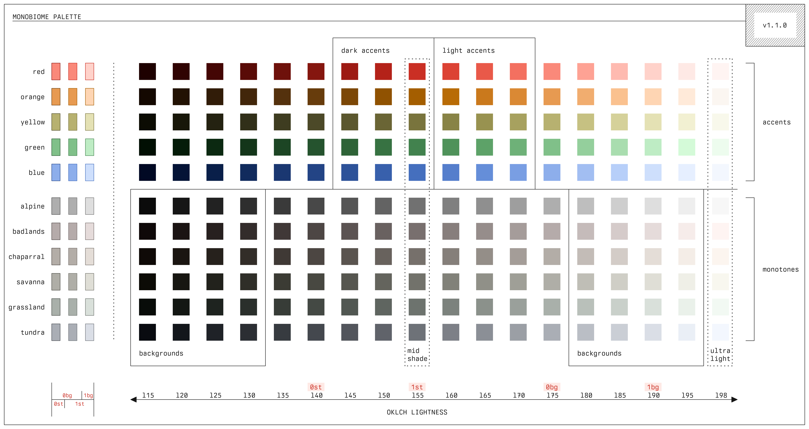
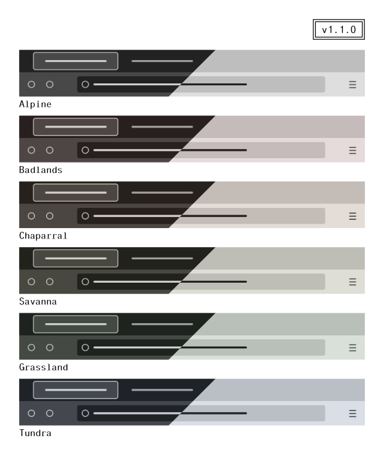

# Monobiome
`monobiome` is a minimal, balanced color palette for use in terminals and text
editors. It was designed in OKLCH space to achieve perceptual uniformity across
all hues at various levels of luminance, and does so for eight monotone bases
and eight accent colors (plus one zero chroma default base). Each of the
monotone base colors (named according to a natural biome whose colors they
loosely resemble) are designed to achieve identical contrast with the accents,
and thus any one of the options can be selected to change the feeling of the
palette without sacrificing readability.


_(Preview of light and dark alpine theme variants)_

The name "monobiome" connects the palette to its two key sources of
inspiration:

- `mono-`: `monobiome` is inspired by the [`monoindustrial` theme][1], and
  attempts to extend and balance its accents while retaining similar color
  identities.
- `-biome`: the desire for several distinct monotone options entailed finding a
  way to ground the subtle color variations that were needed, and I liked the
  idea of tying the choices to naturally occurring environmental variation like
  Earth's biomes (even if it is a very loose affiliation, e.g., green-ish =
  grass, basically).

## Palette
The `monobiome` palette is fundamentally a set of parameterized curves in OKLCH
color space. Each color identity has one monotone curve and one accent curve,
both of which have fixed hue values and vary from 10% to 98% lightness.
Monotone curves have fixed chroma, whereas the accent curves' chroma varies
smoothly as a function of lightness within sRGB gamut bounds.

| Chroma curves | Color trajectories |
|---|---|
|  |  |

| Palette |
|---|
|  |

There are eight monotone-accent pairs, plus a single grey trajectory:

| Monotone / biome | Accent color | Hue  |
| ---              | ---          | ---  |
| alpine           | grey         | n/a  |
| badlands         | red          | 29   |
| chaparral        | orange       | 62.5 |
| savanna          | yellow       | 104  |
| grassland        | green        | 148  |
| reef             | cyan         | 205  |
| tundra           | blue         | 262  |
| heathland        | violet       | 306  |
| moorland         | magenta      | 350  |

The `alpine`/`grey` curve has zero chroma (and is thus invariant to hue),
varying only in lightness from dark to light grey.

## Concrete themes

| Dark themes | Light themes |
|---|---|
|  |  |

Themes are derived from the `monobiome` palette by selecting a monotone base
(the "biome"), a base lightness, and a contrast level. Although one can use
arbitrary contrast metrics, OKLCH distance (Euclidean distance in OKLab)
is designed to capture perceptual distinction. As such, perceptually uniform
themes under arbitrary monotones can be generated by calculating the accent
colors equidistant from that base. This is equivalent to determining the points
at which a sphere centered at the monotone base intersects with the accent
curves; the radius of such a sphere effectively determines the theme contrast,
and the colors on the sphere surface are equally perceptually distinct relative
to the background. 

The following plots show the intersection of the sphere centered at a fixed
background color (`alpine` biome with a lightness of 20) under variable radii:

| | `-l 20 -d 0.3` | `-l 20 -d 0.4` | `-l 20 -d 0.5` |
|---|---|---|---|
| Color visualization |  |  |  |
| Editor preview |  |  |  |

In short, the base lightness (`-l`) dictates the brightness of the background,
and the contrast (`-d`) controls how perceptually distinct the accent colors
appear with respect to that background. These are free parameters of the
`monobiome` model: themes can be generated under arbitrary settings that meet
user preferences.

The "soft" harshness level uses monotone shades closer to the mid-shade
(lightness level 55), whereas "hard" harshness uses shades further from it.
Once the biome and harshness level are chosen, we're left with a bounded
monotone range over which common theme elements can be defined.

## Applications
When generating full application themes, fixed lightness steps are used in the
chosen monotone trajectory to establish consistent levels of distinction
between background layers. For example, the following demonstrates how
background and foreground elements are chosen for the `monobiome` vim/neovim
themes:


Note how theme elements are mapped onto the general identifiers `bg0-bg3` for
backgrounds, `fg0-fg3` for foregrounds, and `gray` for a central gray tone. The
relative properties (lightness differences, contrast ratios) between colors
assigned to these identifiers are preserved regardless of biome or harshness
(e.g., `bg3` and `gray` are _always_ separated by 20 lightness points in any
theme). As a result, applying `monobiome` themes to specific applications can
effectively boil down to defining a single "relative template" that uses these
identifiers, after which any user-provided parameters can be applied
automatically. You can read more about how themes are created in
[DESIGN](DESIGN.md).

# Usage
This repo provides *relative* theme templates for `kitty`, `vim`/`neovim`, and
`fzf` in the `templates/apps` directory, along with *concrete* themes in
`app-config/`. You can also find raw palette colors in `templates/apps/groups/`
if you want to use them to define static themes for other applications.

Each of the files in the `app-config/` directory are named according to

```sh
<harshness>-<biome>-monobiome-<mode>.<ext>
```

For example, `monobiome-tundra-dark-soft.vim` is the Vim theme file for the
dark `tundra` variant with a soft harshness level.

## Applications
- `kitty`

  Find `kitty` themes in `app-config/kitty`. Themes can be activated in your
  `kitty.conf` with
  
  ```sh
  include <theme-file>
  ```

  Themes are generated using the [`kitty` theme
  template](templates/apps/kitty/templates/active.theme).

- `vim`/`neovim`

  Find `vim`/`neovim` themes in `app-config/nvim`. Themes can be activated by placing a
  theme file on Vim's runtime path and setting it in your `.vimrc`/`init.vim`
  with
  
  ```sh
  colorscheme <theme-name>
  ```

  Themes are generated using the [`vim` theme
  template](templates/apps/nvim/templates/theme.vim).

- `fzf`

  In `app-config/fzf`, you can find scripts that can be ran to export FZF theme
  variables. In your shell config (e.g., `.bashrc` or `.zshrc`), you can source
  these files to apply them in your terminal:
  
  ```sh
  source <theme-file>
  ```

  Themes are generated using the [`fzf` theme
  template](templates/apps/fzf/templates/active.theme).

- Firefox

  Firefox themes for all monotone backgrounds are publicly listed as [Mozilla
  add-ons][2], and switch between light/dark schemes based on system settings.
  You can also download raw XPI files for each theme in `app-config/firefox/`,
  each of which is generated using the [Firefox `manifest.json`
  template](templates/apps/firefox/templates/none-dark.manifest.json).

  Static [light][4] and [dark][5] are additionally available.

  

# Switching themes
[`symconf`][3] is a general-purpose application config manager that can be used
to generate all `monobiome` variants from a single palette file, and set themes
for all apps at once. You can find example theme templates in
`templates/groups/theme`, which provide general theme variables you can use in
your own config templates.

For instance, in an app like `kitty`, you can define a template like

```conf
# base settings
background           f{{theme.term.background}}
foreground           f{{theme.term.foreground}}

selection_background f{{theme.term.selection_bg}}
selection_foreground f{{theme.term.selection_fg}}

cursor               f{{theme.term.cursor}}
cursor_text_color    f{{theme.term.cursor_text_color}}

# black
color0               f{{theme.term.normal.black}}
color8               f{{theme.term.bright.black}}

# red
color1               f{{theme.term.normal.red}}
color9               f{{theme.term.bright.red}}

# green
color2               f{{theme.term.normal.green}}
color10              f{{theme.term.bright.green}}

# yellow
color3               f{{theme.term.normal.yellow}}
color11              f{{theme.term.bright.yellow}}

# blue
color4               f{{theme.term.normal.blue}}
color12              f{{theme.term.bright.blue}}

# purple (red)
color5               f{{theme.term.normal.purple}}
color13              f{{theme.term.bright.purple}}

# cyan (blue)
color6               f{{theme.term.normal.cyan}}
color14              f{{theme.term.bright.cyan}}

## white
color7               f{{theme.term.normal.white}}
color15              f{{theme.term.bright.white}}
```

and use `symconf` to dynamically fill these variables based on a selected
biome/harshness/mode. This can be done for any app config file.


[1]: https://github.com/isa/TextMate-Themes/blob/master/monoindustrial.tmTheme
[2]: https://addons.mozilla.org/en-US/firefox/collections/18495484/monobiome/
[3]: https://github.com/ologio/symconf
[4]: https://addons.mozilla.org/en-US/firefox/collections/18495484/monobiome-light/
[5]: https://addons.mozilla.org/en-US/firefox/collections/18495484/monobiome-dark/
