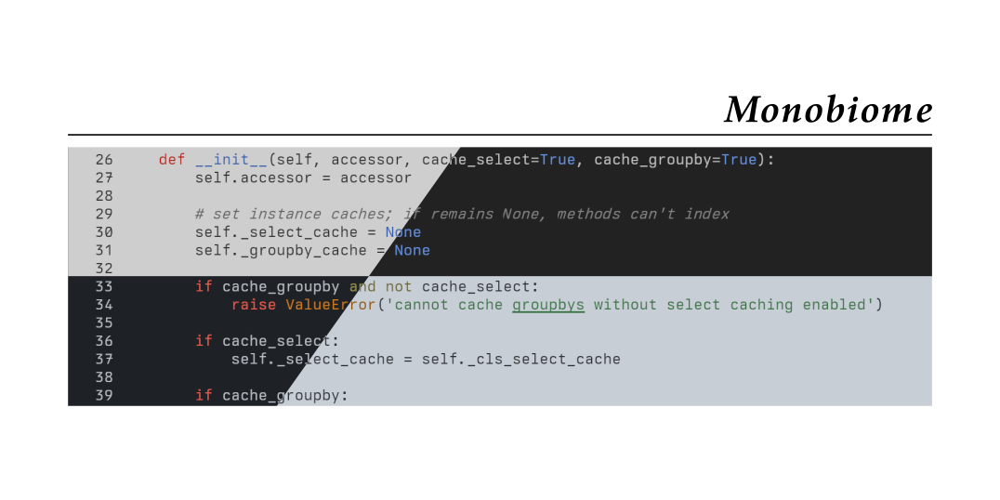
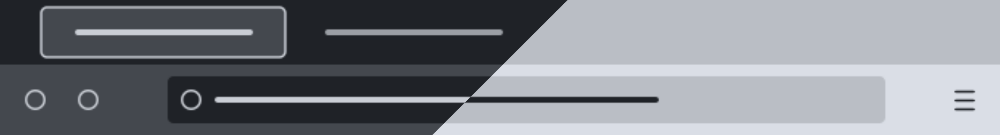

# Monobiome
`monobiome` is a minimal, balanced color palette for use in terminals and text
editors. It was designed in OKLCH space to achieve perceptual uniformity across
all hues at various levels of luminance, and does so for _five_ monotone bases
and _five_ accent colors (plus one gray "default"). Each of the monotone base
colors (named according to a natural biome whose colors they loosely resemble)
are designed to achieve identical contrast with the accents, and thus any one
of the options can be selected to change the feeling of the palette without
sacrificing readability.


_(Preview of default light and dark theme variants)_

See screenshots for the full set of theme variants in [THEMES](THEMES.md) (also
discussed below).

The name "monobiome" connects the palette to its two key sources of
inspiration:

- `mono-`: `monobiome` is inspired by the [`monoindustrial` theme][1], and
  attempts to extend and balance its accents while retaining similar color
  identities.
- `-biome`: the desire for several distinct monotone options entailed finding a
  way to ground the subtle color variations that were needed, and I liked the
  idea of tying the choices to naturally occurring environmental variation like
  Earth's biomes (even if it is a very loose affiliation, e.g., green-ish =
  grass, basically).

## Palette
The `monobiome` palette consists of four monotone bases and five accent colors,
each of which is anchored by hue and spread uniformly across lightness levels
15 to 95 (in OKLCH space). 


The chroma curve for each accent is carefully designed to vary smoothly across
the lightness spectrum, with the goal of retaining strong color identity in all
settings. Additionally, as alluded to above, the (WCAG 2) contrast ratio
between any choice of monotone background at a given lightness level and the
accent colors is virtually identical ($\pm 0.1$). Put another way, the relative
contrast between accents depends only on the _lightness_ of the background
monotone, not its hue. *(Note that this is not generally the case; at a fixed
lightness level, the contrast between two colors depends on their hue.)*

## Concrete themes


*(Light and dark theme splits of Alpine and Tundra biomes)*

Themes are derived from the `monobiome` palette by varying both the monotone
hue (the "biome") and the extent of the background/foreground lightness (the
"harshness"). This is done for both light and dark schemes, and in each case
accent colors are selected at a lightness level that ensures each meet a
minimum contrast relative to the primary background. The following diagram
shows each of the 36 resulting combinations:


The "soft" harshness level uses monotone shades closer to the mid-shade
(lightness level 55), whereas "hard" harshness uses shades further from it.
Once the biome and harshness level are chosen, we're left with a bounded
monotone range over which common theme elements can be defined. For example,
the following demonstrates how background and foreground elements are chosen
for the `monobiome` Vim themes:


Note how theme elements are mapped onto the general identifiers `bg0-bg3` for
backgrounds, `fg0-fg3` for foregrounds, and `gray` for a central gray tone. The
relative properties (lightness differences, contrast ratios) between colors
assigned to these identifiers are preserved regardless of biome or harshness
(e.g., `bg3` and `gray` are _always_ separated by 20 lightness points in any
theme). As a result, applying `monobiome` themes to specific applications can
effectively boil down to defining a single "relative template" that uses these
identifiers, after which any of the 36 theme options can applied immediately.

Read more about how themes are created in [DESIGN](DESIGN.md).

# Usage
This repo provides the 36 theme files for `kitty`, `vim`/`neovim`, and `fzf` in
the `app-config/` directory. You can also find raw palette colors in
`colors/monobiome.toml` if you want to use them to define themes for other
applications.

Each of the files in the `app-config/` directory are named according to

```sh
<harshness>-<biome>-monobiome-<mode>.<ext>
```

For example, `monobiome-tundra-dark-soft.vim` is the Vim theme file for the
dark `tundra` variant with the soft harshness level.

## `kitty`
Find `kitty` themes in `app-config/kitty`. Themes can be activated in your
`kitty.conf` with

```sh
include <theme-file>
```

## `vim`/`neovim`
Find `vim`/`neovim` themes in `app-config/nvim`. Themes can be activated by placing a
theme file on Vim's runtime path and setting it in your `.vimrc`/`init.vim`
with

```sh
colorscheme <theme-name>
```

## `fzf`
In `app-config/fzf`, you can find scripts that can be ran to export FZF theme
variables. In your shell config (e.g., `.bashrc` or `.zshrc`), you can source
these files to apply them in your terminal:

```sh
source <theme-file>
```

## Firefox
Find links to install available light/dark Firefox themes for each biome in
[FIREFOX](/FIREFOX.md). You can also download raw XPI files for each theme in
`app-config/firefox/`.


*Default monobiome*


*Grassland monobiome*


*Tundra monobiome*


*Savanna monobiome*

# Switching themes
[`symconf`][3] is a general-purpose application config manager that can be used
to generate all `monobiome` variants from a single palette file, and set themes
for all apps at once. You can find example theme templates in
`templates/groups/theme`, which provide general theme variables you can use in
your own config templates.

For instance, in an app like `kitty`, you can define a template like

```conf
# base settings
background           f{{theme.term.background}}
foreground           f{{theme.term.foreground}}

selection_background f{{theme.term.selection_bg}}
selection_foreground f{{theme.term.selection_fg}}

cursor               f{{theme.term.cursor}}
cursor_text_color    f{{theme.term.cursor_text_color}}

# black
color0               f{{theme.term.normal.black}}
color8               f{{theme.term.bright.black}}

# red
color1               f{{theme.term.normal.red}}
color9               f{{theme.term.bright.red}}

# green
color2               f{{theme.term.normal.green}}
color10              f{{theme.term.bright.green}}

# yellow
color3               f{{theme.term.normal.yellow}}
color11              f{{theme.term.bright.yellow}}

# blue
color4               f{{theme.term.normal.blue}}
color12              f{{theme.term.bright.blue}}

# purple (red)
color5               f{{theme.term.normal.purple}}
color13              f{{theme.term.bright.purple}}

# cyan (blue)
color6               f{{theme.term.normal.cyan}}
color14              f{{theme.term.bright.cyan}}

## white
color7               f{{theme.term.normal.white}}
color15              f{{theme.term.bright.white}}
```

and use `symconf` to dynamically fill these variables based on a selected
biome/harshness/mode. This can be done for any app config file.


[1]: https://github.com/isa/TextMate-Themes/blob/master/monoindustrial.tmTheme
[3]: https://github.com/ologio/symconf
