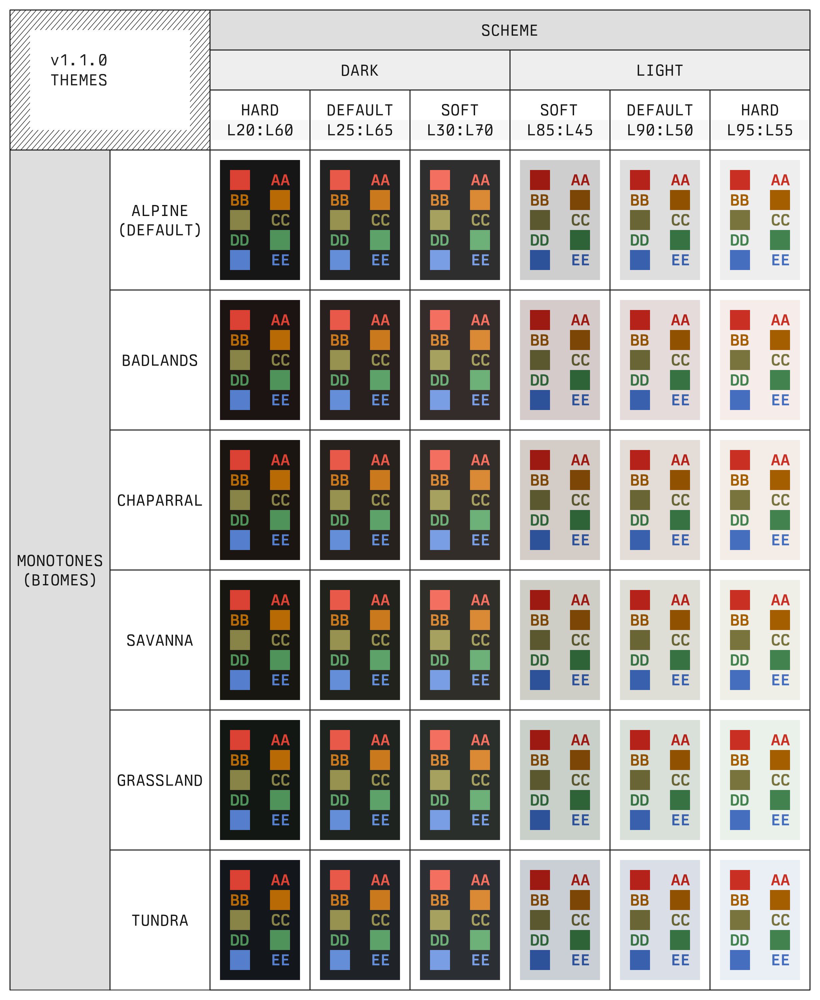

# Monobiome
`monobiome` is a minimal, balanced color palette for use in terminals and text editors. It
was designed in OKLCH space to achieve perceptual uniformity across all hues at various
levels of luminance, and does so for _four_ monotone bases and _five_ accent colors. Each
of the monotone base colors (named according to a natural biome whose colors they loosely
resemble) are designed to achieve identical contrast with the accents, and thus any one of
the four can be selected to change the feeling of the palette without sacrificing
readability.

_(Preview of default light and dark theme variants)_

See screenshots for the full set of theme variants in [THEMES](THEMES.md) (also discussed
below).

The name "monobiome" connects the palette to its two key sources of inspiration:

- `mono-`: `monobiome` is inspired by the [`monoindustrial` theme][1], and attempts to extend
  and balance its accents while retaining similar color identities.
- `-biome`: the desire for several distinct monotone options entailed finding a way to ground the
  subtle color variations that were needed, and I liked the idea of tying the choices to
  naturally occurring environmental variation like Earth's biomes (even if it is a very
  loose affiliation, e.g., green-ish = grass, basically).

## Palette
The `monobiome` palette consists of four monotone bases and five accent colors, each of
which is anchored by hue and spread uniformly across lightness levels 15 to 95 (in OKLCH
space). 

The chroma curve for each accent is carefully designed to vary smoothly across the
lightness spectrum, with the goal of retaining strong color identity in all settings.
Additionally, as alluded to above, the (WCAG 2) contrast ratio between any choice of
monotone background at a given lightness level and the accent colors is virtually
identical ($\pm 0.1$). Put another way, the relative contrast between accents depends only
on the _lightness_ of the background monotone, not its hue.

## Concrete themes

_(Default light theme variants)_

_(Default dark theme variants)_

Themes are derived from the `monobiome` palette by varying both the monotone hue (the
"biome") and the extent of the background/foreground lightness (the "harshness"). This is
done for both light and dark schemes, and in each case accent colors are selected at a
lightness level that ensures each meet a minimum contrast relative to the primary
background. The following diagram shows each of the 24 resulting combinations:

The "soft" harshness level uses monotone shades closer to the mid-shade (lightness level
55), whereas "hard" harshness uses shades further from it. Once the biome and harshness
level are chosen, we're left with a bounded monotone range over which common theme
elements can be defined. For example, the following demonstrates how background and
foreground elements are chosen for the `monobiome` Vim themes:

Note how theme elements are mapped onto the general identifiers `bg0-bg3` for backgrounds,
`fg0-fg3` for foregrounds, and `gray` for a central gray tone. The relative properties
(lightness differences, contrast ratios) between colors assigned to these identifiers are
preserved regardless of biome or harshness (e.g., `bg3` and `grey` are _always_ separated
by 20 lightness points in any theme). As a result, applying `monobiome` themes to specific
applications can effectively boil down to defining a single "relative template" that uses
these identifiers, after which any of the 24 theme options can applied immediately.

Read more about how themes are created in [DESIGN](DESIGN.md).

# Usage
This repo provides the 24 theme files for `kitty`, `vim`/`neovim`, [`vim-airline`][2], and
`fzf`. We also provide the raw palette colors if you want to use them to define themes for
other applications.

## `kitty`

## `vim`/`neovim`

## `vim-airline`

## `fzf`

(add `synconf` here)

[1]: https://github.com/isa/TextMate-Themes/blob/master/monoindustrial.tmTheme
[2]: https://github.com/vim-airline/vim-airline
